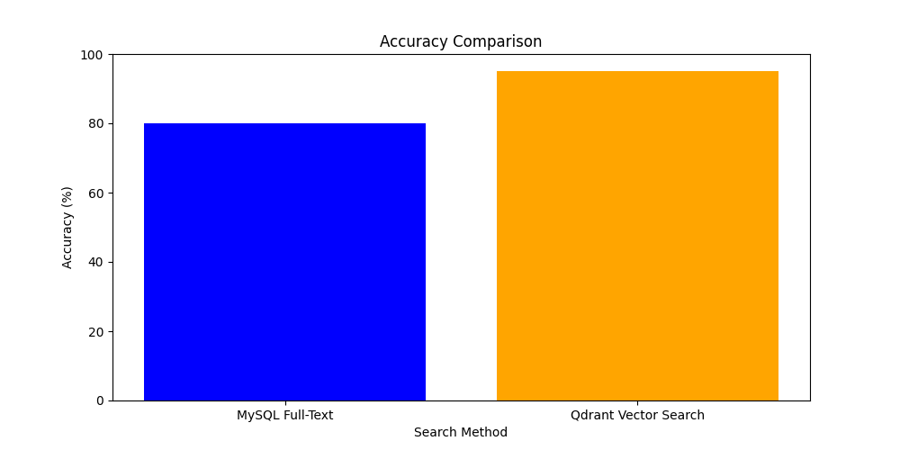
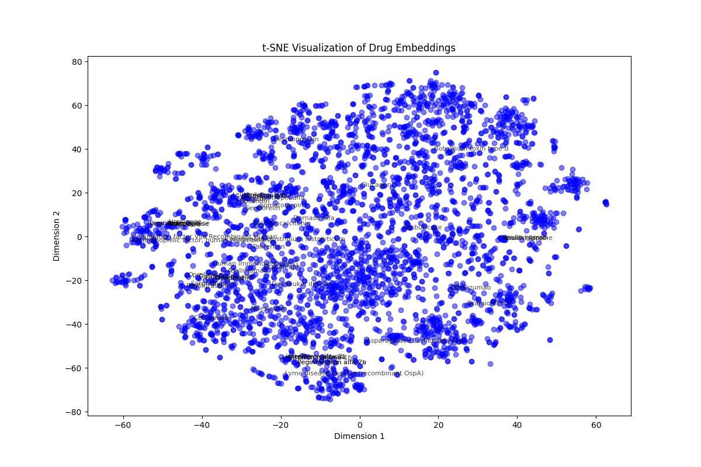
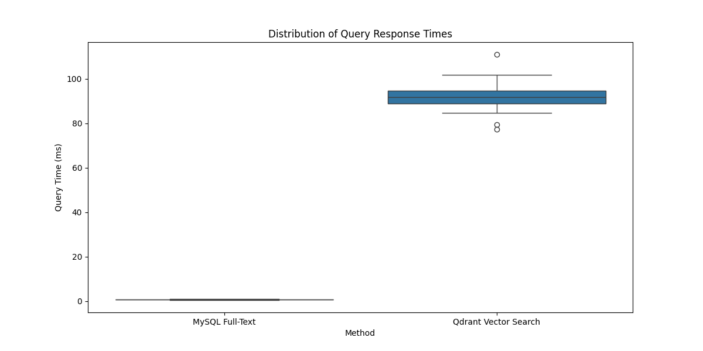
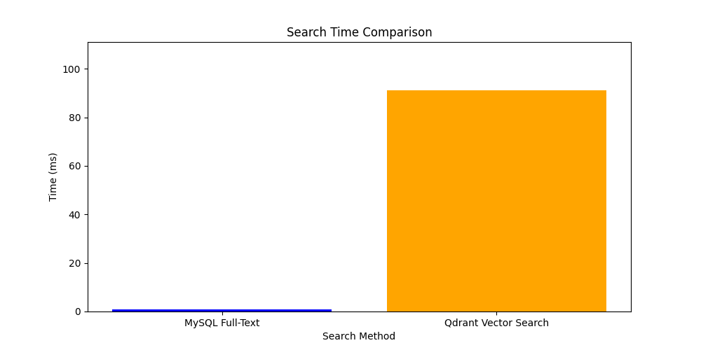

# MediSearchAI: A smarter way to search for medicines

## Overview

MediSearchAI is a proof of concept (POC) to showcase how vector search can make our interaction with pharmaceutical data information a lot easier. Taking advantage of cutting-edge sentence embeddings in combination with a vector DB, this project goes beyond keyword matching, providing a more intelligent, flexible and accurate search capabilities.

If you’ve ever had a hard time finding other, more specific pharmaceutical questions like **“Which painkillers can help with a fever?”** or, **“What can I take instead of ibuprofen?”**, MediSearchAI strives to deliver useful responses.

This POC connects **intfloat/multilingual-e5-base** (precision-optimized multilingual text embeddings) and Qdrant, the high-performance vector database, to udnerstand diverse and often-complex drug data.

## Pharmaceuticals: Why Vector Search?

The pharmaceutical industry The pharmaceutical domain presents unique challenges:

- **Synonyms & Variants**: One drug could have dozens of brand names, synonyms or formulations.

- **Multilingual Use Cases**: Healthcare is global, we need solutions that work across languages.

- **Semantic Nuances**: The types of questions doctors and pharmacists ask are very different.

This is where vector search shines because it understands context, not just exact matches. It enables us to search by meaning, including queries that are fuzzy or incomplete, so it is an excellent

## Main Features

- The **integrated semantic retrieval engine provides accurate drug searches based on context**, rather than keywords alone. The engine supports searches like "Relieve my headache" with actual drugs such as Paracetamol and Ibuprofen, even though the query may not correspond exactly to the terms.

- **Multiple Metadata Filters**: You can filter data results based on dose, indication, or mechanism of action.

- **Multi-Language support**: Based on a collection of embeddings that support multiple languages, this method provides a uniform way for handling and managing the world's medical data.

- **Built for Speed Optimization** as it is, a setup with GPUs means that large models can almost certainly handle real-time response times

## What will you get out of this?

No matter whether you work in research pharma, healthcare, or develop technology for the life sciences, as long as it contains a bit of AI, MediSearchAI is fertile ground for finding how we might improve our way through vast amounts housing data.

This POC is an example of what happens when we put the right pieces in place - model embedders, vector databases, and principles for semantic searches.

## Getting started

### Requirements

1. **Hardware**:
   - An NVIDIA GPU with CUDA support is recommended. (e.g., RTX 3060 or better).
   - Minimum 8GB VRAM for larger datasets.

2. **Software**:
   - Python 3.8+ and Docker.
   - Pre-installed CUDA drivers for GPU use.

### Setup Instructions

1. **Clone the Repository**:
   ```bash
   git clone https://github.com/Siddhant-K-code/MediSearchAI
   cd MediSearchAI
   ```

2. **Install Dependencies**:
   ```bash
   pip install -r requirements.txt
   ```

3. **Run Qdrant**:
   Start the vector database:
   ```bash
   docker-compose -f docker/docker-compose.yml up -d
   ```

4. **Preprocess the Data**:
   Clean and prepare the dataset:
   ```bash
   python scripts/preprocess.py
   ```

5. **Generate Embeddings**:
   Transform drug data into vector embeddings:
   ```bash
   python scripts/embedding.py
   ```

6. **Upload to Qdrant**:
   Store the embeddings in the vector database:
   ```bash
   python scripts/qdrant_setup.py
   ```

7. **Search**:
   Test out a query:
   ```bash
   python scripts/search.py
   ```

## Results

### Example Query

**Input**:
*"Pain relief for fever"*

**Output**:

```plaintext
Name: Paracetamol
Indication: Pain relief; fever
Mechanism: Inhibits cyclooxygenase enzymes in the brain.
Targets: COX-1, COX-2
--------------------------------------------------
Name: Ibuprofen
Indication: Pain relief; inflammation; fever
Mechanism: Non-selective COX inhibitor.
Targets: COX-1, COX-2
--------------------------------------------------
```

### Performance Metrics

| **Metric**             | **MySQL Full-Text Search** | **Vector Search (Qdrant)** |
| ---------------------- | -------------------------- | -------------------------- |
| Query Preparation Time | **0ms**                    | **50ms (embedding)**       |
| Search Execution Time  | **<1ms**                   | **~1ms**                   |
| Total Time Per Query   | **<1ms**                   | **~51ms**                  |

### Graphical Insights

#### 1. Accuracy Comparison
Qdrant outperforms MySQL Full-Text Search in delivering semantically accurate results:



---

#### 2. Clustering Visualization
Drugs with similar properties cluster together in a t-SNE visualization of embeddings:



---

#### 3. Query Time Distribution
A comparison of query response times for MySQL Full-Text Search and Qdrant Vector Search:



---

#### 4. Search Time Breakdown
A detailed breakdown of query preparation and execution times:



---

## Why Use Vector Search?

| **Use Case**                              | **MySQL Full-Text** | **Vector Search**          |
| ----------------------------------------- | ------------------- | -------------------------- |
| **Keyword Matching**                      | ✅ Very fast         | ✅ Supported (with meaning) |
| **Semantic Matching**                     | ❌ Not supported     | ✅ Accurate                 |
| **Handling Synonyms (e.g., Paracetamol)** | ❌ Fails             | ✅ Supported                |
| **Fuzzy Queries (e.g., Headache relief)** | ❌ Fails             | ✅ Matches intent           |
| **Multilingual Support**                  | ❌ Limited           | ✅ Excellent                |


## Limitations

- **Dependency on GPUs**:
   - While the setup works on a CPU, embedding generation is significantly slower without a GPU.
- **Initial Data Preparation**:
   - Data cleaning and preprocessing are manual and require domain knowledge.

## License
This project is licensed under the [MIT License](./LICENSE). Feel free to use, adapt, and extend it as needed.
